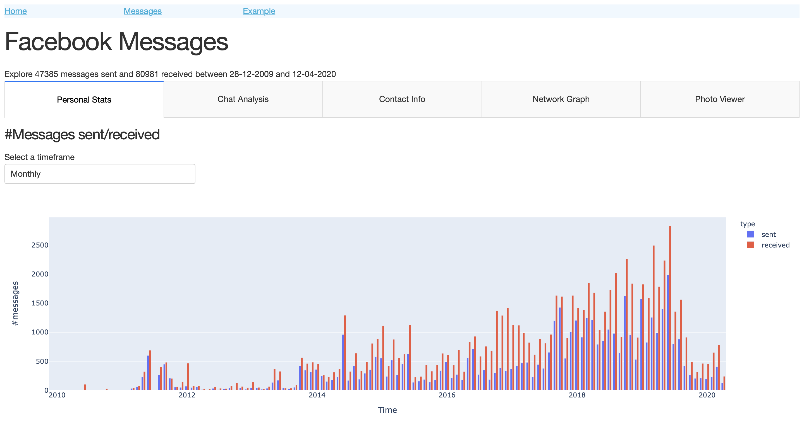
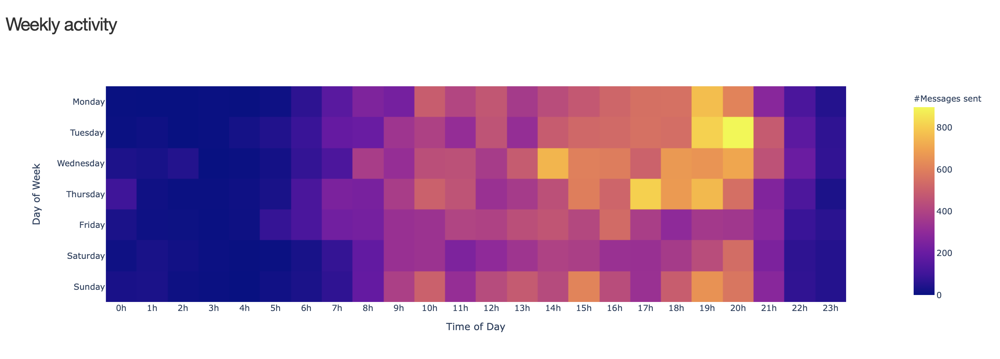
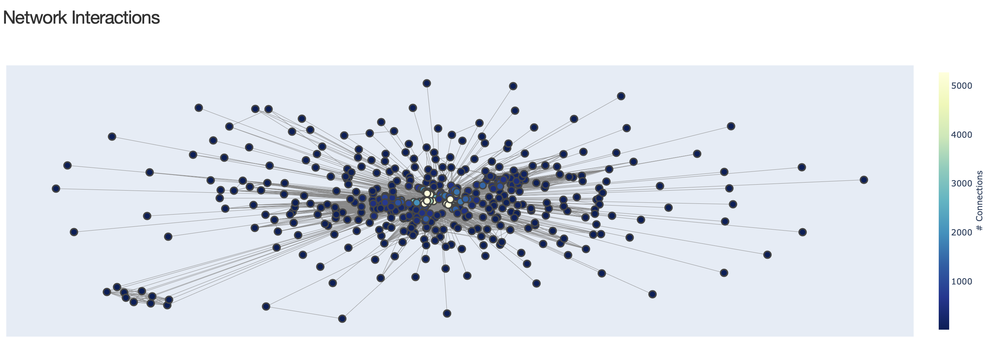

# fb-analysis

Interactive dashboard to explore your personal Facebook Messenger data dump using Plotly Dash.

## Features

The application displays various statistics, trends and features derived from your raw Facebook data dump.
Currently included:

* Personal stats
  * All time number of messages sent & received (yearly/monthly/daily)
  * Heatmap of weekly activity
  * Number of messages received per contact




* Chat analysis
  * All time message count per participant (yearly/monthly/daily)
  * Message count per participant per hour-of-day / day-of-week
  * Pie chart of messages per participant
  * Most frequent words per participant


* Contact Info
  * Message count, vocabulary size, average word length, average number of words per message for each of your contacts.
* Network Graph
  * Interactive visualization of your social network derived solely from your messages and group chats



* Photo Viewer
  * Image gallery of all photos ever sent/received per chat.

## Prerequisites

1. Download your facebook messages in `.json` format, and unzip.
2. Edit `DATA_DIR` and `MY_NAME` in `config.py`. `DATA_DIR` should be the full path to the `"data"` directory.
3. Install the required packages in a clean virtual environment:

```bash
pip install -r requirements.txt
```

## Run the app

```bash
python index.py
```

The webserver will load at [http://127.0.0.1:8050](http://127.0.0.1:8050).

## Contributing

Have a look at the `apps/example` directory to get started building new features.
Pull requests are welcome :)
